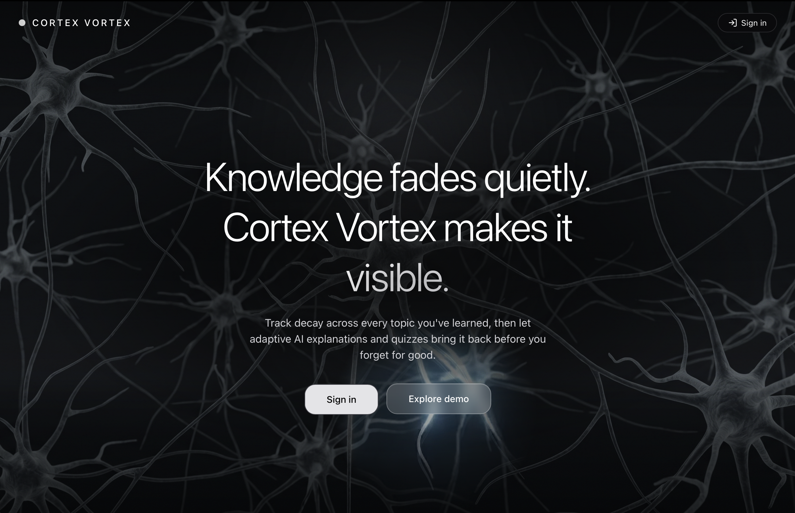
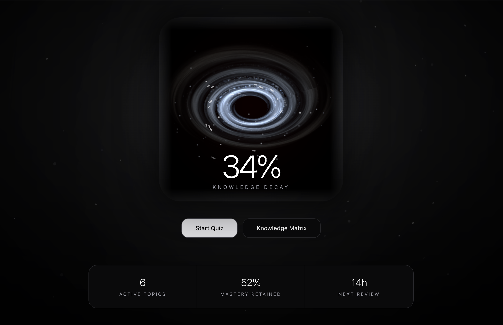
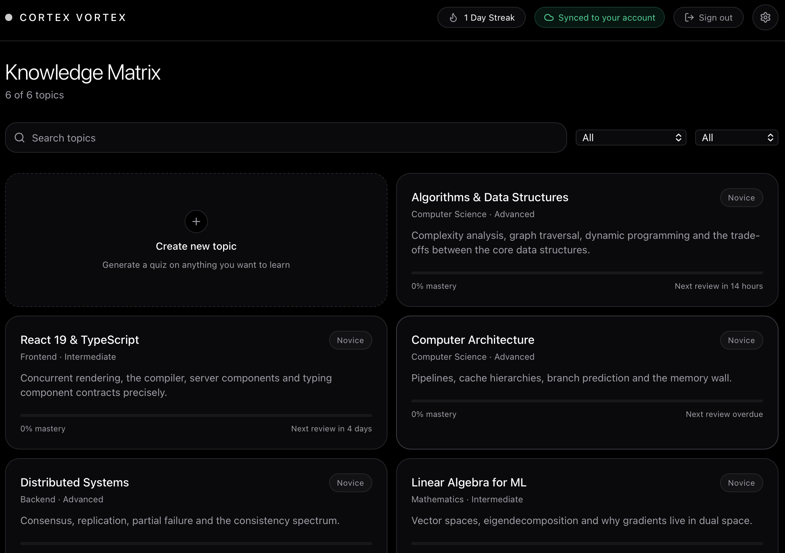
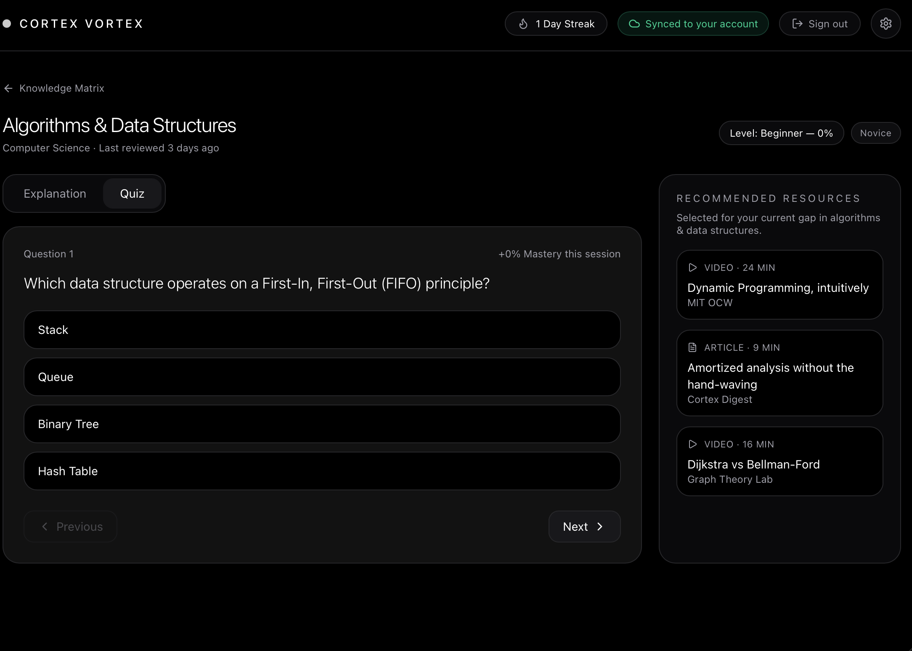
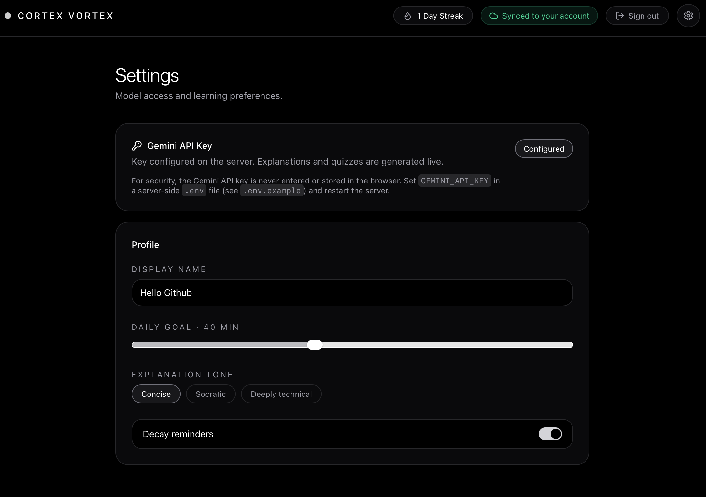

# Cortex Vortex

Adaptive learning portfolio: make **knowledge decay** visible, track mastery, and refresh topics with AI explanations and quizzes.

Built as a full-stack portfolio project — works as a demo without a backend; sign-in syncs progress via Supabase and unlocks live Gemini AI.

<p align="left">
  <a href="https://vortex.berger-labs.com"></a>
  <a href="https://github.com/Simons-Github/cortex-vortex/actions/workflows/ci.yml"></a>
  
  
  
  
  
  
</p>

|                |                                                                                          |
| -------------- | ---------------------------------------------------------------------------------------- |
| **Live Demo**  | [vortex.berger-labs.com](https://vortex.berger-labs.com)                                 |
| **Repository** | [github.com/Simons-Github/cortex-vortex](https://github.com/Simons-Github/cortex-vortex) |
| **Author**     | [Simon Berger](https://github.com/Simons-Github)                                         |

---

## Problem & Idea

Knowledge fades when it isn’t practiced — yet most learning apps barely surface that. Cortex Vortex puts **decay** at the center of the UI: an animated vortex and clear mastery levels show where refresh is needed. The Study Room then delivers adaptive explanations and quizzes instead of static lists and flashcards.

Portfolio goal: a real full-stack app with auth, RLS, server-side AI, and a demo path that runs immediately without API keys.

---

## Screenshots

|                                    Landing                                    |                                             Dashboard                                              |
| :---------------------------------------------------------------------------: | :------------------------------------------------------------------------------------------------: |
|  |  |
|                                  Hero & auth                                  |                                      Vortex, decay %, streak                                       |

|                                 Knowledge Matrix                                 |                               Study Room — Quiz                                |
| :------------------------------------------------------------------------------: | :----------------------------------------------------------------------------: |
|  |  |
|                             Search, filters, mastery                             |                            Adaptive multiple choice                            |

<p align="center">
  
  <br />
  <em>Settings — Gemini status, BYOK key, and preferences</em>
</p>

---

## Highlights

- OLED-dark UI with an animated **Knowledge Vortex** (WebGL field, atmosphere, particles) and decay readout
- **Study Room** with explanation chat and multiple-choice quiz (tabs)
- Prompt shortcuts: Simplify, Deepen, Real-world example, Weak spots
- **Knowledge Matrix** with search, category, and difficulty filters
- Mastery levels: Novice · Developing · Mastered
- Auth via **Supabase** (email/password + Google), including merge of local progress
- Mastery & streak: Supabase (synced) or localStorage fallback
- **Gemini** only via server functions — platform API key never in the browser bundle; signed-in users can store their own key (encrypted at rest)
- Custom topics (Gemini moderation + RPC insert) with a **combined** daily quota and DB-backed burst limits
- Demo mode without a backend — runs out of the box

---

## Tech Stack

| Area     | Technology                                            |
| -------- | ----------------------------------------------------- |
| Frontend | React 19, TypeScript, TanStack Router / Start / Query |
| Styling  | Tailwind CSS 4, shadcn/ui, Lucide                     |
| AI       | Google Gemini (`@google/genai`, server-only)          |
| Backend  | Supabase (PostgreSQL, Auth, RLS, RPCs)                |
| Server   | TanStack Start server functions, Nitro                |
| Hosting  | [Vercel](https://vortex.berger-labs.com)              |
| Tooling  | Vite 8, ESLint, Prettier, Playwright                  |

---

## Architecture

```
Browser (React)
    ├── Supabase JS Client     →  Auth + PostgreSQL (RLS / RPCs)
    └── TanStack Server Fns    →  Gemini (explain / quiz / create_topic)
                                      ↑
                               GEMINI_API_KEY (server-only platform key)
                               or decrypted BYOK key (AES-256-GCM)
                               USER_KEY_ENCRYPTION_SECRET + SUPABASE_SERVICE_ROLE_KEY
                               burst + daily quota via RPCs
                               (daily quota skipped when the caller has BYOK)
```

No separate REST backend: UI and client logic live in the frontend; persistence and access control in Supabase; AI only through server functions. Without Supabase/Gemini, mock data and localStorage take over.

### Design Decisions (Portfolio)

| Decision                                       | Why                                                                                    |
| ---------------------------------------------- | -------------------------------------------------------------------------------------- |
| Server functions instead of client-side Gemini | API key stays on the server; CSRF middleware for server fns                            |
| RLS + SECURITY DEFINER RPCs                    | Mastery/streak/custom topics are SELECT-only for clients; writes only via RPCs         |
| Demo without keys                              | Recruiting/review path: clickable immediately, no setup                                |
| localStorage → Supabase merge                  | Pre-login progress isn’t lost after sign-in                                            |
| Combined daily quota + burst RPCs              | Cost control for Gemini on a public demo, across Vercel instances                      |
| BYOK in `private` + AES-256-GCM                | User keys never hit PostgREST as plaintext; daily quota protects only the platform key |

---

## Feature Status

| Feature                                            | Status                      |
| -------------------------------------------------- | --------------------------- |
| Landing page + demo access                         | ✅                          |
| Dashboard (vortex, decay %, stats, streak)         | ✅                          |
| Study Room — explanation chat                      | ✅                          |
| Study Room — adaptive quizzes                      | ✅                          |
| Knowledge Matrix (filter / search)                 | ✅                          |
| Custom topics (Gemini + moderation)                | ✅ (5-question quiz rounds) |
| Login / sign-up (email)                            | ✅                          |
| Mastery sync (Supabase) + localStorage fallback    | ✅                          |
| Streak tracking                                    | ✅                          |
| Combined AI daily quota (5) + 60s burst limits     | ✅                          |
| Bring-your-own Gemini key (encrypted, signed-in)   | ✅                          |
| Settings (Gemini status, BYOK key, preferences UI) | ✅                          |
| Live demo on Vercel                                | ✅                          |
| Google OAuth                                       | ✅                          |
| GitHub Actions CI                                  | ✅                          |
| E2E tests (Playwright)                             | ✅                          |

---

## Quick Start

**Requirements:** Node.js 22+, npm  
Optional: a Supabase project and Gemini API key for sync + live AI

```sh
git clone https://github.com/Simons-Github/cortex-vortex.git
cd cortex-vortex
cp .env.example .env
npm install
npm run dev
```

Dev server: [http://localhost:8080](http://localhost:8080)

`.env` (all variables optional for demo-only mode):

```env
VITE_SUPABASE_URL=https://<project-id>.supabase.co
VITE_SUPABASE_PUBLISHABLE_KEY=<publishable-key>

# Server-only — no VITE_ prefix (never shipped to the browser)
GEMINI_API_KEY=
# Optional (default: gemini-3.6-flash)
# GEMINI_MODEL=

# BYOK (optional): signed-in users can store their own Gemini key
# USER_KEY_ENCRYPTION_SECRET=   # openssl rand -base64 32
# SUPABASE_SERVICE_ROLE_KEY=    # server-only; never in the client
```

### Supabase

Apply **all** of `supabase/sql/` in the SQL Editor **before** deploying app code that calls the RPCs. Snippets are idempotent; order still matters because `custom_topics.sql` resets `ai_usage_log_endpoint_check`.

**Fresh project**

1. `profiles.sql` — profiles + signup trigger
2. `user_topic_mastery.sql` — mastery table (SELECT-only)
3. `mastery_streak_rpcs.sql` — `increment_mastery` / `touch_streak`
4. `quiz_attempts.sql` — attempt log + `log_quiz_attempt` / `list_recent_quiz_misses` / `apply_quiz_result`
5. `ai_usage_log.sql` — usage log + `log_ai_usage` / `try_log_ai_usage`
6. `custom_topics.sql` — custom topics table (SELECT-only; no client INSERT)
7. `user_gemini_keys.sql` — `private.user_gemini_keys` + service_role RPCs + `try_log_key_save`
8. `create_custom_topic.sql` — atomic quota + insert RPC (skips quota when a BYOK row exists)
9. `ai_burst_limit.sql` — **last** among usage-log files (`burst_*` including `burst_save_key`)
10. `security_hardening_p0.sql` — extra GRANT/REVOKE hardening (safe on a fresh DB too)

**Existing project (upgrade)** — same files; also re-run `quiz_attempts.sql` for attempt logging + `apply_quiz_result`. Also re-run `ai_combined_daily_quota.sql` if the DB still has a per-endpoint daily cap instead of the combined pool of 5. Always run `ai_burst_limit.sql` after `custom_topics.sql`. For BYOK, run `user_gemini_keys.sql` then re-run `create_custom_topic.sql` and `ai_burst_limit.sql`.

Then:

10. Enable **Authentication → Providers → Email** (and Google, if used)
11. Set redirect URLs (local: `http://localhost:8080`; production: `https://vortex.berger-labs.com`)
12. Optional: enable [leaked password protection](https://supabase.com/docs/guides/auth/password-security#password-strength-and-leaked-password-protection) in Auth settings

### Scripts

| Command                                    | Description                                                |
| ------------------------------------------ | ---------------------------------------------------------- |
| `npm run dev`                              | Dev server (port 8080)                                     |
| `npm run lint`                             | ESLint                                                     |
| `npm run typecheck`                        | TypeScript (`tsc --noEmit`)                                |
| `npm run format`                           | Prettier                                                   |
| `npm run build`                            | Production build (client + Nitro)                          |
| `npm run preview`                          | Preview the local build                                    |
| `npm run test:e2e`                         | Playwright demo smoke tests (starts the dev server)        |
| `npm run test:e2e:ui`                      | Playwright UI mode                                         |
| `npx tsx scripts/test-topic-moderation.ts` | Gemini moderation cases + RPC/INSERT probes (needs `.env`) |
| `npx tsx scripts/test-user-key-crypto.ts`  | AES-GCM roundtrip, AAD tamper, hint masking                |

After a local Node-preset build:

```sh
node .output/server/index.mjs
```

Playwright covers the unsigned demo path (landing, dashboard, matrix, study room, settings). Chromium is enough for CI:

```sh
npx playwright install chromium
npm run test:e2e
```

To hit an already-running server or the live demo instead of starting `vite dev`:

```sh
PLAYWRIGHT_BASE_URL=https://vortex.berger-labs.com npm run test:e2e
```

---

## Database

| Table / RPC                 | Purpose                                                                           |
| --------------------------- | --------------------------------------------------------------------------------- |
| `profiles`                  | Streak (`streak_count`, `last_active_date`) — SELECT-only for clients             |
| `user_topic_mastery`        | Mastery score per topic — SELECT-only                                             |
| `custom_topics`             | User-created topics — SELECT-only; inserts via RPC only                           |
| `ai_usage_log`              | Rolling 24h AI quota log (plus 60s `burst_*` rows)                                |
| `private.user_gemini_keys`  | Encrypted BYOK Gemini keys — not in the Data API; service_role RPCs only          |
| `service_*_user_gemini_key` | SECURITY DEFINER — upsert/load/hint/delete; `auth.role()` must be `service_role`  |
| `try_log_key_save`          | SECURITY DEFINER — 5 key-saves per rolling 10 minutes                             |
| `quiz_attempts`             | Per-answer log (SELECT-only); stems truncated to 500                              |
| `log_quiz_attempt`          | SECURITY DEFINER — insert one attempt (`auth.uid()`)                              |
| `list_recent_quiz_misses`   | SECURITY DEFINER — last N missed stems for a topic                                |
| `apply_quiz_result`         | SECURITY DEFINER — `correct` only; delta via `levelFor` then `increment_mastery`  |
| `increment_mastery`         | SECURITY DEFINER — delta ±10, score 0–100 (`last_reviewed_at`)                    |
| `touch_streak`              | SECURITY DEFINER — streak per calendar day                                        |
| `create_custom_topic`       | SECURITY DEFINER — quota + insert (quota skipped when a BYOK row exists)          |
| `log_ai_usage`              | SECURITY DEFINER — visibility-only rows (e.g. `topic_moderation`)                 |
| `try_log_ai_usage`          | SECURITY DEFINER — atomic combined 24h quota (5 across explain/quiz/create_topic) |
| `try_log_ai_burst`          | SECURITY DEFINER — atomic 60s burst reserve                                       |

Relevant tables use **Row Level Security** (`auth.uid()` = own row). Mastery, streak, custom topics, and quiz attempts are not written directly from the client — only through RPCs.

**Daily AI limit (rolling 24h, combined):** 5 requests total across Explain, Quiz, and Create Topic — skipped when the caller has a stored BYOK key (the pool protects the platform key, not the user's own Google bill)  
**Burst limits (rolling 60s, cross-instance):** Explain 20 · Quiz 30 · Create Topic 5 (still apply with BYOK)  
**Key save limit:** 5 attempts per rolling 10 minutes

### BYOK threat model

- Ciphertext lives in `private` (not exposed through PostgREST). Privileged RPCs refuse any JWT except `service_role`. The app server always keys rows by `auth.getUser()`, never by a client-supplied user id.
- The platform Gemini key and the encryption secret stay in server env (`no VITE_` prefix). After save, the browser only sees a 4-character hint.
- XSS at the moment of paste can still steal a key sitting in the input; we do not persist plaintext in `localStorage` or cookies. A compromised app server that also has `USER_KEY_ENCRYPTION_SECRET` can decrypt every stored key — expected without a KMS, and documented rather than hidden.
- `USER_KEY_ENCRYPTION_SECRET` currently has no rotation path: there is no dual-key decrypt and no re-encryption of existing `private.user_gemini_keys` rows. The payload is version-prefixed (`v1.`), but there is no `v2` migration. Rotating the secret would mean decrypting every stored row with the old secret and re-encrypting under a new prefix (e.g. `v2.`) before removing the old secret from the environment. For a portfolio project without KMS/HSM this is an accepted trade-off: a compromised master secret means every user must paste their BYOK key again, rather than a transparent background rotation.
- Restrict user keys to the Generative Language API in Google Cloud. IP allowlists are a poor fit for Vercel.

---

## Project Structure

```
src/
├── routes/           # TanStack Router (Landing, Dashboard, Study, Matrix, Settings)
├── components/       # Vortex (shader / atmosphere / particles), Auth, Topic dialog, UI
├── lib/              # auth, mastery-store, gemini*, supabase, mock-data
├── server/           # Token verification, burst/quota RPCs, BYOK crypto + store
└── styles.css        # Design tokens & animations
e2e/                  # Playwright demo smoke tests
scripts/              # Moderation + RPC probe + crypto roundtrip (tsx)
supabase/sql/         # Schema snippets + RLS / RPCs
public/               # vortex.png, robots.txt, screenshots/
```

---

## Deployment

Live: **[vortex.berger-labs.com](https://vortex.berger-labs.com)**

Production builds use [Nitro](https://nitro.build). On Vercel, `vercel.json` sets the framework (`tanstack-start`); locally you get a Node server under `.output/`.

**Before a production deploy**

1. Apply `supabase/sql/` in the order above (especially `user_gemini_keys.sql` before `create_custom_topic.sql`, and `ai_burst_limit.sql` last). Shipping app code first will break custom-topic creation.
2. Confirm Auth redirect URLs include the production origin.
3. Set env vars on Vercel (never a Supabase **service role** key in the client):

| Variable                        | Scope                       |
| ------------------------------- | --------------------------- |
| `VITE_SUPABASE_URL`             | Build + runtime             |
| `VITE_SUPABASE_PUBLISHABLE_KEY` | Build + runtime             |
| `GEMINI_API_KEY`                | Runtime (server-only)       |
| `GEMINI_MODEL`                  | Optional                    |
| `USER_KEY_ENCRYPTION_SECRET`    | Runtime (server-only, BYOK) |
| `SUPABASE_SERVICE_ROLE_KEY`     | Runtime (server-only, BYOK) |

Leave **Output Directory** empty in project settings (no manual `dist`).

Demo mode (no Supabase/Gemini) is intentional for local clones. Production should have both configured so quotas and live AI actually run.

---

## Known limitations

- Custom-topic **quizzes** seed question 1 at create time via `sessionStorage` (not the URL). The rest of the 5-question round is filled by `generateQuiz`, which resolves both demo and custom topics.
- Topic-name moderation (`isTopicAllowed`) runs in the app server, not inside `create_custom_topic`. A direct PostgREST RPC call can skip Gemini classification (quota and structural title checks still apply).
- Playwright covers the unsigned demo path, not signed-in AI flows. Use `scripts/test-topic-moderation.ts` for moderation/RPC probes.

---

## Roadmap

- [x] Google OAuth
- [x] GitHub Actions (lint + typecheck + build + Playwright)
- [x] Playwright smoke tests (demo path; optional live URL via `PLAYWRIGHT_BASE_URL`)
- [x] Follow-up quiz questions for custom topics
- [ ] Short architecture note / case study for applications

---

## License & Author

MIT © 2026 **[Simon Berger](https://github.com/Simons-Github)** — portfolio project.

Live demo: [vortex.berger-labs.com](https://vortex.berger-labs.com) · Code: [cortex-vortex](https://github.com/Simons-Github/cortex-vortex)
